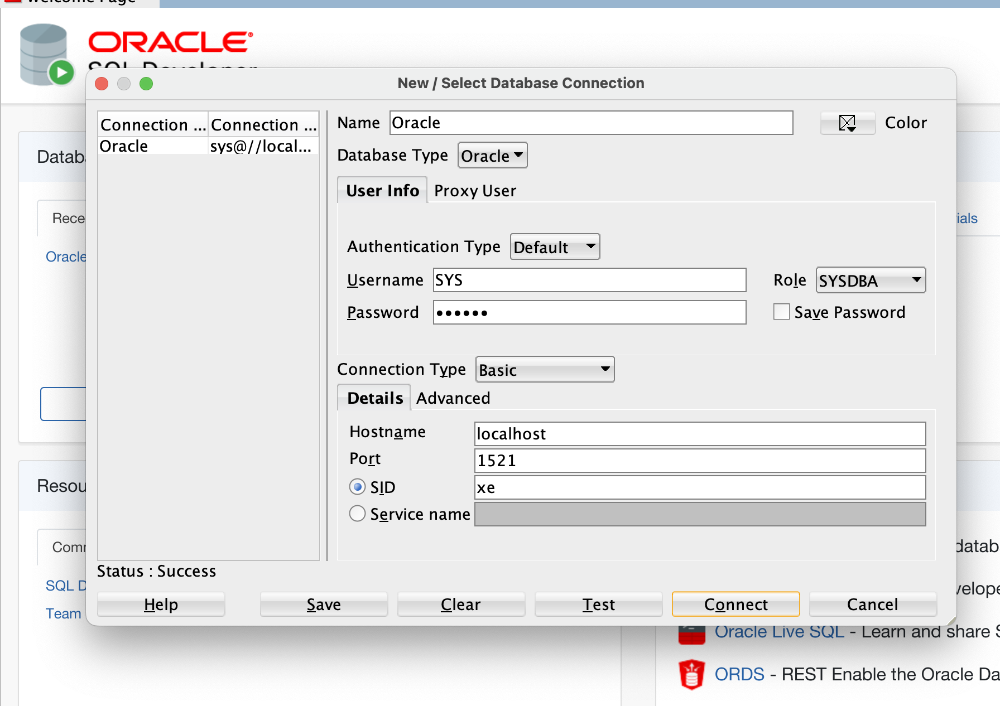

# Consultas a bases de datos relaciones (Oracle)

En este repositorio encontrarás la solución al proyecto final del ramo con el mismo nombre al del título, en este caso haremos uso de el motor de bases de datos Oracle, específicamente a la versión express:latest.

Dentro del repositorio encontrarás la información necesaria para levantar el servidor de Oracle, info de las tablas y la problemática a resolver usando SQL.


# Setup

En este caso, este servidor está corriendo en local desde mi macbook, por ende considera lo siguiente:

1. Tener instalado SQL Developer (cliente oficial de oracle).

2. Docker instalado.

## Instrucciones de instalación

1. Levantar docker

2. Correr el siguiente comando:
```bash
docker run --name <nombre-contenedor> -p 1521:1521 -d --shm-size='8g' -e ORACLE_PWD=<contraseña> container-registry.oracle.com/database/express:latest
```

3. Establecer conexión


# Problemas

1.	Crear un procedimiento de pl/sql que solicite el código de sucursal y muestre el nombre de la sucursal junto con el total de clientes, préstamos y cuentas corrientes que tiene.

2.	Crear un procedimiento de pl/sql que solicite el código de la sucursal y muestre los nombres de los clientes de esa sucursal (deben tener cta cte o prestamos en esa sucursal).

3.	Crear una función de pl/sql que solicite un rut de cliente y muestre la cantidad de productos bancarios que tiene.

4.	Crear una función de pl/sql que solicite un rut de cliente y muestre el nombre del cliente y su monto total de sus préstamos. 

